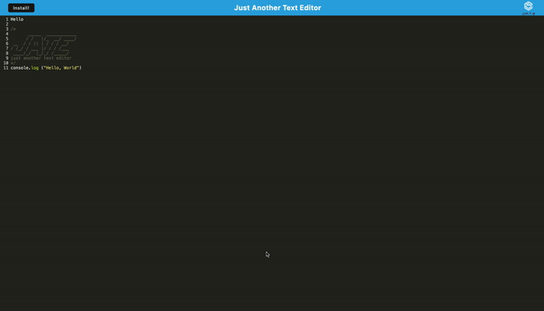
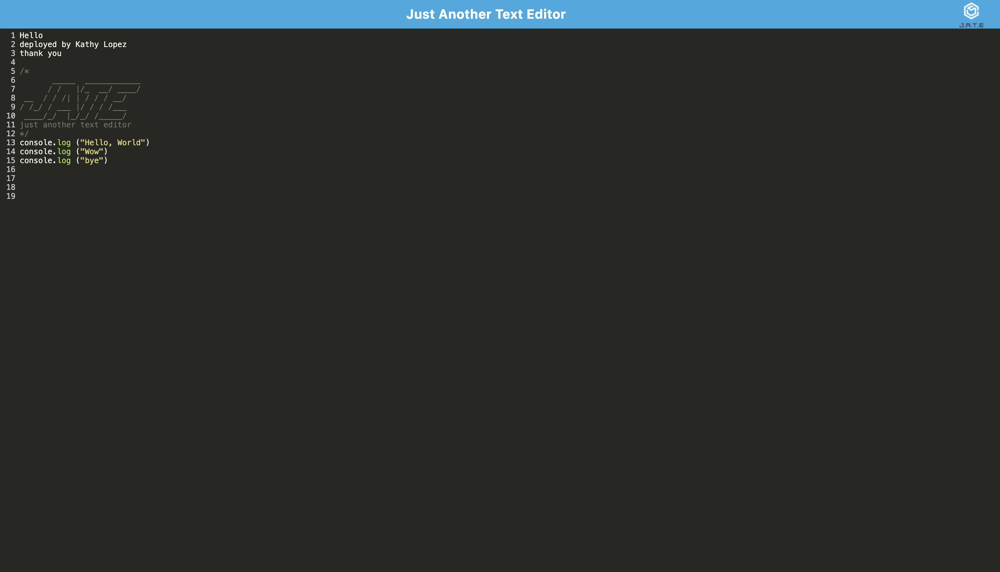

# Progressive-Web-Applications-PWA-Challenge-Text-Editor

[](https://opensource.org/licenses/MIT)

  


## User Story
```
AS A developer
I WANT to create notes or code snippets with or without an internet connection
SO THAT I can reliably retrieve them for later use
```
## Acceptance Criteria
```
GIVEN a text editor web application
WHEN I open my application in my editor
THEN I should see a client server folder structure
WHEN I run `npm run start` from the root directory
THEN I find that my application should start up the backend and serve the client
WHEN I run the text editor application from my terminal
THEN I find that my JavaScript files have been bundled using webpack
WHEN I run my webpack plugins
THEN I find that I have a generated HTML file, service worker, and a manifest file
WHEN I use next-gen JavaScript in my application
THEN I find that the text editor still functions in the browser without errors
WHEN I open the text editor
THEN I find that IndexedDB has immediately created a database storage
WHEN I enter content and subsequently click off of the DOM window
THEN I find that the content in the text editor has been saved with IndexedDB
WHEN I reopen the text editor after closing it
THEN I find that the content in the text editor has been retrieved from our IndexedDB
WHEN I click on the Install button
THEN I download my web application as an icon on my desktop
WHEN I load my web application
THEN I should have a registered service worker using workbox
WHEN I register a service worker
THEN I should have my static assets pre cached upon loading along with subsequent pages and static assets
WHEN I deploy to Render
THEN I should have proper build scripts for a webpack application


```
## Table of Contents

- [Description](#description)
- [Links](#links)
- [Installation](#installation)
- [Usage](#usage)
- [License](#license)
- [Credits](#credits)
- [Contact me](#contact-me)


  
## Description
Overview of PWA text editor to use cilent and server file structures to generate a text editor online or offline. As a developer, I used my knowledge of express.js, css, index.html, and npm i packages to build scripts and webpack in javascript.
 As well as use formal functionaility to create a quality live web application and deploy using render.
## Links
- [The URL of the deployed application](https://progressive-web-applications-pwa-bzhu.onrender.com/)
- [The URL of Github Repository](https://github.com/kathylopez97/Progressive-Web-Applications-PWA-Challenge-Text-Editor)


## Installation 

Instructions on how 


1. Clone the repo
   ```
   git@githubcom:kathylopez97Progressive-Web-Applications-PWA-Challenge-Text-Editor.git
   ```
2. Install NPM packages

   ```
   npm i 
   ```

5. Run Server
   ```
    npm run start or npm run dev
   ```


## Usage
 

## Screenshot 

 
## License 
[](https://opensource.org/licenses/MIT)

## Build with 

- 

## Credits 
- Youtube: [Youtube](https://youtube.com)
- Visual Studio Code: [VS Code](https://code.visualstudio.com/)
- Professional README Guide: [README.md](https://coding-boot-camp.github.io/full-stack/github/professional-readme-guide)
- Render Deployment [Deployment](https://coding-boot-camp.github.io/full-stack/render/render-deployment-guide)


## Contact me


Contact me If you have any questions or additional feedback.
- [Github](https://github.com/kathylopez97)
- [Email](kathyylopezz97@gmail.com)
